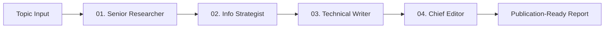

# ResearchFlow AI

> Autonomous Deep Research & Intelligence Engine powered by CrewAI, Google Gemini, and Tavily Search.

[](https://www.python.org/)
[](https://streamlit.io/)
[](https://www.crewai.com/)
[](LICENSE)

---

## Overview

**ResearchFlow AI** is an enterprise-grade autonomous research platform. Given any research topic, it deploys a collaborative crew of 4 specialized AI agents that sequentially explore the live internet, filter and structure raw intelligence, draft comprehensive analytical narratives, and fact-check publication-ready reports in minutes.

---

## Autonomous Multi-Agent Pipeline



1. **Step 01 - Senior Research Analyst**: Explores real-time web documents via Tavily API, gathers facts, statistical metrics, and source URLs.
2. **Step 02 - Information Strategist**: Filters noise, synthesizes raw data, and establishes a logical heading hierarchy.
3. **Step 03 - Technical Writer**: Authors comprehensive, articulate, and deeply engaging analytical drafts with in-text citations.
4. **Step 04 - Chief Editor**: Rigorously reviews grammar, factual flow, and formatting to produce flawless Markdown output.

---

## Features

- **Bilingual Interface (English & বাংলা)**: Instant top-level language switcher with fully localized strings and zero mixed language leakage.
- **Enterprise-Grade UI**: Built with custom high-contrast styling, Plus Jakarta Sans typography, and SVG vector iconography.
- **Quick-Select Topic Presets**: One-click topic suggestion chips to quickly trigger domain-specific analyses.
- **Multi-Tab Report Viewer**:
  - *Formatted Document*: Styled typography view for seamless reading.
  - *Raw Markdown*: Code-block view with easy copying.
  - *Agent Pipeline Log*: Full execution timeline and metadata.
- **Instant Export**: Download finalized reports in both **Markdown (`.md`)** and **Plain Text (`.txt`)** formats.

---

## Quick Start

### 1. Clone the Repository
```bash
git clone https://github.com/Udipto-Mondal/ResearchFlow-AI.git
cd ResearchFlow-AI
```

### 2. Set Up Virtual Environment
```bash
python -m venv .venv
# On Windows:
.venv\Scripts\activate
# On macOS/Linux:
source .venv/bin/activate
```

### 3. Install Dependencies
```bash
pip install -r requirements.txt
```

### 4. Configure API Keys
Create a `.env` file in the root directory (or copy from `.env.example`):
```env
GEMINI_API_KEY=your_google_gemini_api_key
TAVILY_API_KEY=your_tavily_api_key
```

### 5. Run the Application
```bash
streamlit run app.py
```
Open your browser at `http://localhost:8501`.

---

## Project Structure

```
ResearchFlow-AI/
├── .env.example          # Environment variables template
├── .gitignore            # Git ignore configuration
├── app.py                # Streamlit web application & bilingual UI
├── agents.py             # CrewAI Agent definitions
├── tasks.py              # CrewAI Task definitions
├── crew.py               # Crew orchestration and execution flow
├── requirements.txt      # Python dependencies
└── README.md             # Project documentation
```

---

## Tech Stack

- **Framework**: [CrewAI](https://www.crewai.com/)
- **LLM Engine**: [Google Gemini](https://ai.google.dev/)
- **Search API**: [Tavily Search](https://tavily.com/)
- **Frontend / UI**: [Streamlit](https://streamlit.io/) with Custom CSS
- **Language**: Python 3.10+

---

## License

This project is licensed under the MIT License.
